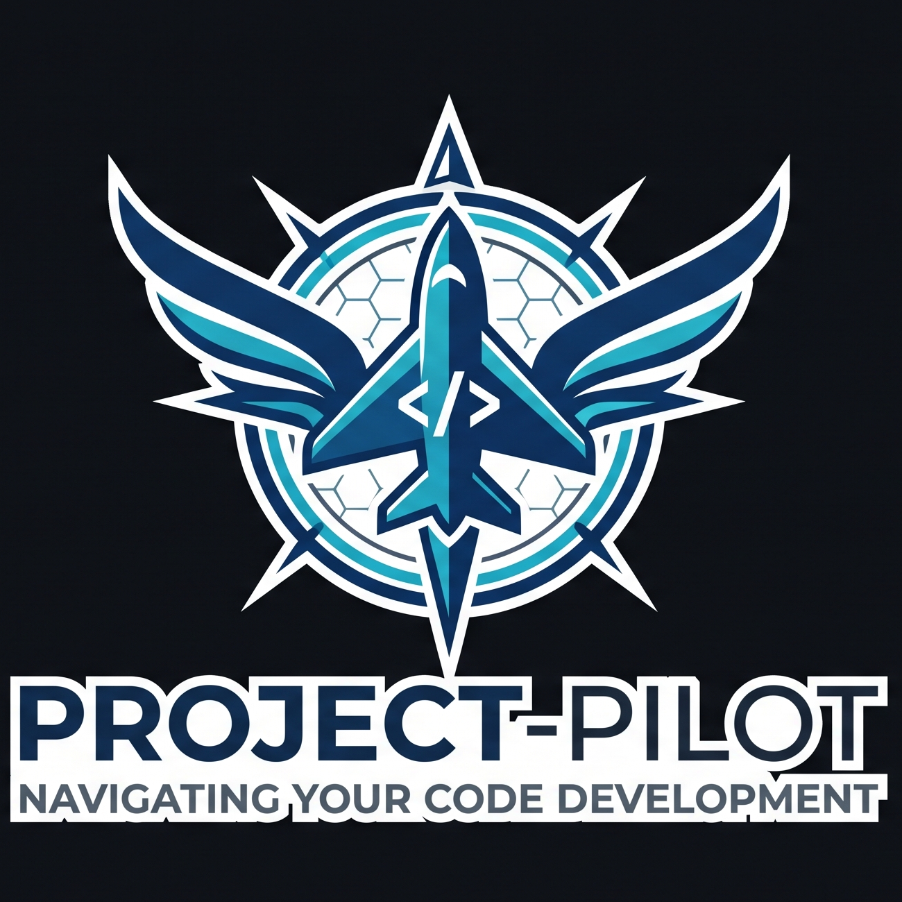

<div align="center">
  

  # Project Pilot — Claude Code Plugin

  > Full-stack project architect · session memory manager · codebase navigator

  [](LICENSE)
</div>

---

Project Pilot handles the work that happens *before* you write code and *between* every session — architecture decisions, CLAUDE.md generation, session memory, and a live codebase graph that makes file search fast and token-cheap.

---

## ✨ Modes

### 🏗️ Architect Mode — new projects
Trigger: *"I want to build X"*, *"help me plan my app"*, *"what stack should I use"*

- Runs a **15-question interview** in two rounds (vision → technical depth)
- Recommends tech stack, team size, folder structure, and best practices
- Generates `CLAUDE.md` with sub-agent routing rules and 15 token optimisation rules
- Generates `PROJECT_MEMORY.md` for session continuity
- **Auto-runs Graph Mode** immediately after to map the new project

### 🔁 Memory Mode — returning sessions
Trigger: *"where were we"*, *"continue the project"*, *"new session"*, or `PROJECT_MEMORY.md` found

- Reads `PROJECT_MEMORY.md` and delivers a **6-line context summary** instantly
- Logs decisions, new dependencies, and schema changes mid-session
- Patches only changed sections at session end — no full rewrites
- Updates `CODEBASE_GRAPH.md` immediately whenever a new file, route, model, or dependency is added

### 🗂️ Init Mode — existing projects
Trigger: `/pilot-init`, *"init my project"*, *"setup claude.md for existing project"*

- Scans the codebase to auto-detect stack, framework, ORM, auth, infra, and test setup
- Asks only **3 targeted questions** (what scanning can't answer)
- Generates `CLAUDE.md` + `PROJECT_MEMORY.md` from real project state
- **Auto-runs Graph Mode** after to produce a full codebase map

### 📝 Memory-Only Mode — just the memory file
Trigger: `/memory`, *"memory only"*, *"just create memory file"*

- **5 questions**, no architecture interview
- Generates `PROJECT_MEMORY.md` only
- Ideal when `CLAUDE.md` already exists or isn't needed

### 🗺️ Graph Mode — codebase map
Trigger: `/graph`, *"map codebase"*, *"graph my project"* — or **auto-runs after Architect and Init modes**

- Deep-scans the working directory (up to 4 levels, skips build/cache dirs)
- Generates `CODEBASE_GRAPH.md` with:
  - Annotated directory map
  - Module dependency relationships
  - Full API / route surface table
  - Data layer (models, migrations)
  - Key dependencies with versions
  - Environment variable reference
  - Navigation quick-reference ("where do I add X?")
- **Claude uses this file for all file searches** — reads the graph before opening any source file, never globs directories when the graph exists
- Updates incrementally mid-session whenever files are added, routes created, or dependencies installed

---

## 📦 Installation

### Step 1 — Add this marketplace to Claude Code

```bash
/plugin marketplace add Adityatiwari1/project-pilot
```

### Step 2 — Install the plugin

```bash
/plugin install project-pilot@project-pilot
```

### Step 3 — Reload plugins

```bash
/reload-plugins
```

---

## 🚀 Quick Start

| Situation | Say this |
|---|---|
| Starting a new project | *"I want to build a SaaS for X"* |
| Returning to existing work | *"Where were we on my project?"* |
| Existing codebase, no setup | `/pilot-init` |
| Only need memory tracking | `/memory` |
| Map an existing codebase | `/graph` |

---

## 🗂️ Repo Structure

```
project-pilot/
├── assets/
│   └── project-pilot.png        ← Plugin logo
├── .claude-plugin/
│   ├── plugin.json               ← Plugin manifest
│   └── marketplace.json          ← Marketplace catalog
├── skills/
│   └── project-pilot/
│       ├── SKILL.md              ← All 5 modes (Architect, Memory, Init, Memory-Only, Graph)
│       └── references/
│           └── claude-md-template.md
├── LICENSE
└── README.md
```

---

## 🤖 Model Routing (built into every generated CLAUDE.md)

| Task | Model |
|---|---|
| Task decomposition, planning, routing | `claude-haiku-4-5` |
| Code, tests, bug fixes, standard work | `claude-sonnet-4-5` |
| Architecture, deep debugging, security audits | `claude-opus-4-5` |

---

## ⚡ Token Optimisation

Every `CLAUDE.md` this plugin generates includes 15 hardcoded rules. Key ones:

- **Graph-first file search** — Claude reads `CODEBASE_GRAPH.md` before touching any source file
- Diffs over full rewrites
- Haiku for cheap ops (planning, routing, summarising)
- Sub-agent context capping — agents get only the sections they need
- Selective file reads — never load files irrelevant to the current task

---

## 📄 License

MIT
